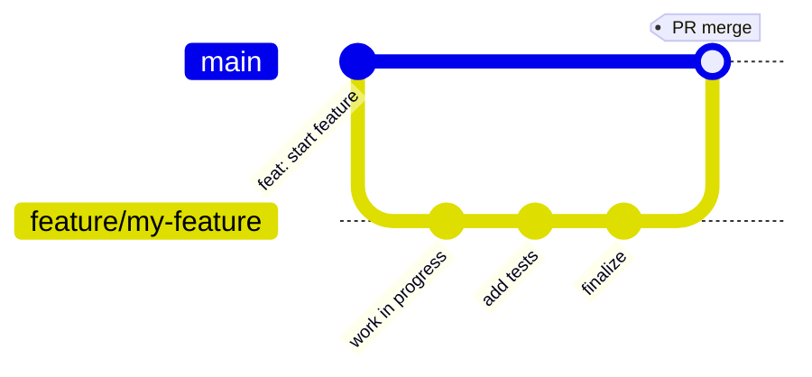

# Branch Protection

## `main` Branch

The `main` branch is protected. All changes must go through a pull request.

### Rules

1. **Require pull request reviews** — at least 1 approval before merging
2. **Require status checks** — CI, lint, and typecheck must pass before merging
3. **Require up-to-date branches** — PR must be rebased on latest `main`
4. **No direct pushes** — only PR merges allowed
5. **Include administrators** — applies to repo admins too

## Workflow

## Release Tags

Version tags (`v*`) are pushed only from `main` after CI passes. No direct pushes to release branches.
