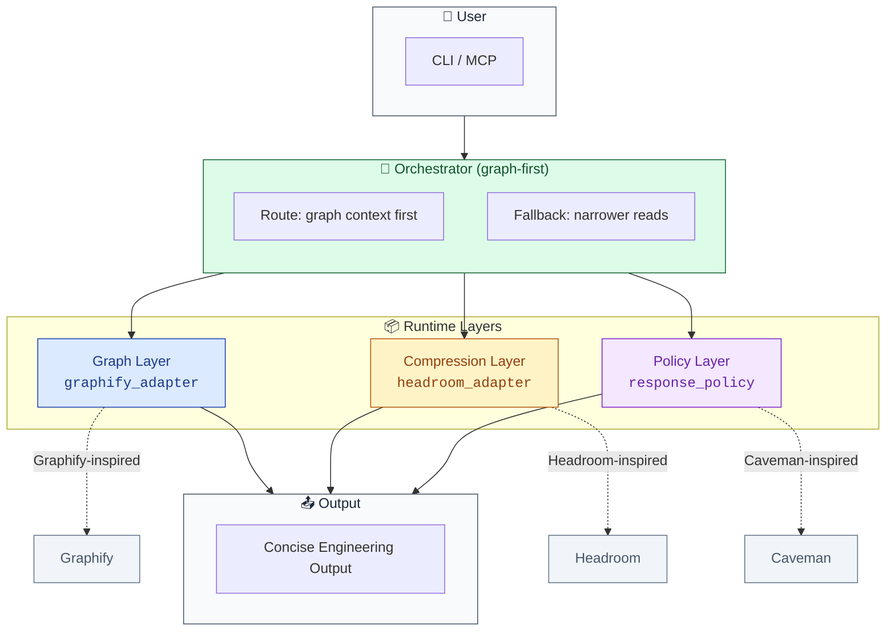

<div align="center">

```
██████╗ ██╗     ██╗████████╗██╗  ██╗██╗ ██████╗    ██████╗██╗     ██╗
██╔════╝██║     ██║╚══██╔══╝██║  ██║██║██╔════╝   ██╔════╝██║     ██║
██║     ██║     ██║   ██║   ███████║██║██║        ██║     ██║     ██║
██║     ██║     ██║   ██║   ██╔══██║██║██║        ██║     ██║     ██║
╚██████╗███████╗██║   ██║   ██║  ██║██║╚██████╗   ╚██████╗███████╗██║
 ╚═════╝╚══════╝╚═╝   ╚═╝   ╚═╝  ╚═╝╚═╝ ╚═════╝    ╚═════╝╚══════╝╚═╝
```

# 🪨 Lithic-CLI

**Graph-first codebase intelligence for AI coding agents**

<p>
  <strong>Cut context cost 80% · Index any repo · Ask architecture questions</strong>
</p>

<p>
  <a href="https://github.com/DelwarOfficial/Lithic-CLI"></a>
  <a href="https://github.com/DelwarOfficial/Lithic-CLI/commits/main"></a>
  <a href="LICENSE"></a>
  <a href="https://github.com/DelwarOfficial/Lithic-CLI#installation"></a>
</p>

<p>
  <a href="#-quick-start"><strong>🚀 Quick Start</strong></a> ·
  <a href="#-installation"><strong>📦 Install</strong></a> ·
  <a href="#-cli-commands"><strong>⚡ Commands</strong></a> ·
  <a href="#-mcp-integration"><strong>🔌 MCP</strong></a> ·
  <a href="#-architecture"><strong>🧠 Architecture</strong></a>
</p>

</div>

---

AI agents waste tokens reading your entire codebase. Lithic builds a live architecture graph first, so agents understand structure, find relevant code, and answer questions without dumping everything into context.

```
┌─────────────────────────────────────────────────────────────────┐
│  📂 Your Codebase  →  🕸️ Graph Index  →  🧠 AI Agent        │
│                     (80% fewer tokens)                         │
└─────────────────────────────────────────────────────────────────┘
```

<strong>🔑 Key Benefits</strong>

- ⚡ **80% token reduction** — compress large tool outputs and code context
- 🕸️ **Graph-first understanding** — know architecture, not just files
- 🔌 **MCP server included** — plug directly into Claude Desktop, Cursor, and more
- 🧩 **Multi-provider ready** — OpenAI, Anthropic, OpenRouter, Ollama

---

## 🚀 What It Does

| Command | Purpose |
|---------|---------|
| `lithic index .` | Build or refresh project graph |
| `lithic ask "..."` | Ask graph-guided architecture question |
| `lithic explain "..."` | Explain symbol/module/file with graph context |
| `lithic path "A" "B"` | Find relationship path in graph |
| `lithic edit "..."` | Orient for edit task (read-only) |
| `lithic review` | Concise review of current diff |
| `lithic commit` | Conventional commit message from changes |
| `lithic compress-file <file>` | Safe compression of large output/logs |
| `lithic stats` | Show nodes, compression, graph info |
| `lithic upstream-status` | Check pinned upstream submodules |
| `lithic mcp serve` | Expose tools over MCP stdio |

---

## 🖥️ Platform Guidelines

### 🍏 Mac Users

#### Installation (single command)

```bash
uv tool install git+https://github.com/DelwarOfficial/Lithic-CLI.git
# or
pip install git+https://github.com/DelwarOfficial/Lithic-CLI.git
```

See main 📦 Installation section for details and dev setup.

#### Keyboard Shortcuts

| Action | Shortcut |
|--------|----------|
| Open terminal | `Cmd + Space` → type "Terminal" |
| Clear screen | `Cmd + K` |
| Cancel running command | `Ctrl + C` |
| Path autocomplete | `Tab` key |
| Command history | `↑` / `↓` arrow keys |

#### Common Issues & Fixes

- **Python version**: Ensure Python 3.12+ is installed (`python3 --version`)
- **Permission denied**: Use `sudo` with caution, or install with `--user` flag
- **Headroom (opt)**: Rust build tools may be needed on Win for full speed. Falls back automatically.

### 🪟 Windows Users

#### Installation (single command)

```powershell
uv tool install git+https://github.com/DelwarOfficial/Lithic-CLI.git
# or
pip install git+https://github.com/DelwarOfficial/Lithic-CLI.git
```

See main 📦 Installation section.

#### Keyboard Shortcuts

| Action | Shortcut |
|--------|----------|
| Open terminal | `Win + R` → type "cmd" or "powershell" |
| Clear screen | `cls` (CMD) or `Clear-Host` (PowerShell) |
| Cancel running command | `Ctrl + C` |
| Path autocomplete | `Tab` key |
| Command history | `↑` / `↓` arrow keys |

#### Common Issues & Fixes

- **Python path**: Ensure Python is in your PATH environment variable
- **Long paths**: Enable long path support in Windows (registry or group policy)
- **Headroom (opt)**: May need Rust/MSVC for full build. Built-in compressor always works.

### 🔧 Universal Guidelines

#### Prerequisites

- [ ] Python 3.12+
- [ ] uv or pip
- [ ] Internet for first install

#### Troubleshooting

1. **Command not found**: Ensure pip/uv tool bin dir in PATH (e.g. `python -m site --user-base` or uv tool path)
2. **Permission errors**: Use `--user` or uv tool
3. **Graph fails**: Run from a writable dir with code to index. `lithic stats` for debug.

---

## ✨ Features

- 🕸️ **Graph-powered indexing** — Build and refresh a project knowledge graph
- 💬 **Natural language queries** — Ask architecture and codebase questions
- 🔍 **Symbol explanation** — Explain symbols, files, modules, and relationships
- 🧩 **Path finding** — Find graph paths between concepts
- 📦 **Smart compression** — Compress large file, shell, log, and diff output safely
- 📝 **Review generation** — Generate concise review output
- 💾 **Commit messages** — Generate Conventional Commit-style commit messages
- 🔌 **MCP server** — Expose core capabilities over Model Context Protocol
- 🧠 **Multi-provider** — Support for OpenAI, Anthropic, OpenRouter, and Ollama

---

## 🧠 Architecture

Lithic is organized into three primary runtime layers coordinated by an orchestrator:



### Layer Responsibilities

| Layer | Module | Purpose |
|-------|--------|---------|
| **Graph** | `lithic.graph.graphify_adapter` | Codebase indexing, architecture mapping, graph-guided exploration |
| **Compression** | `lithic.compression.headroom_adapter` | Deterministic compression for large tool output, logs, JSON, and file reads |
| **Policy** | `lithic.policy.response_policy` | Mode-aware response shaping for review, commit, and concise workflows |

### Data Flow

1. **User input** enters via CLI or MCP
2. **Orchestrator** routes requests **graph-first**
3. **Graph layer** provides architectural context
4. **Compression layer** reduces token usage
5. **Policy layer** shapes the final response
6. **Concise output** is returned to the user

These layers are coordinated by `lithic.orchestrator`, which is intentionally **graph-first**. Broad codebase questions are routed through graph context before narrower reads or downstream actions.

---

## 🔗 Resources

- 📂 [GitHub Repository](https://github.com/DelwarOfficial/Lithic-CLI)
- 🐛 [Issues](https://github.com/DelwarOfficial/Lithic-CLI/issues)
- 📖 [Docs](docs/architecture.md)

---

## 📄 License

MIT

---

> **Need help?** Provide your OS version and the exact error message for faster support.

More architecture details are available in [`docs/architecture.md`](docs/architecture.md).

---

## 📦 Installation

### 📋 Requirements

- 🐍 Python 3.12+
- ⚡ [uv](https://github.com/astral-sh/uv) — Fast Python package installer (recommended) or pip
- 🖥️ A shell environment (PowerShell, Terminal, or Bash)

### 🚀 Install (single command)

**uv tool (recommended - global `lithic` command):**

```powershell
uv tool install git+https://github.com/DelwarOfficial/Lithic-CLI.git
lithic --help
```

**pip:**

```powershell
pip install git+https://github.com/DelwarOfficial/Lithic-CLI.git
lithic --help
```

After install, `cd` into any project and run `lithic` directly. No `uv run`, no clone needed for usage.

### For contributors / dev

```powershell
git clone https://github.com/DelwarOfficial/Lithic-CLI.git
cd Lithic-CLI
uv sync
uv run lithic --help
```

### Optional extras (after install)

```powershell
# reinstall with extras
pip install "git+https://github.com/DelwarOfficial/Lithic-CLI.git[llm,mcp,headroom]"
# or for uv tool (reinstall)
uv tool install --force --with "headroom-ai[proxy,code,mcp,relevance]" git+https://github.com/DelwarOfficial/Lithic-CLI.git
```

On Windows, `headroom-ai` may require [Rust/MSVC build tools](https://rustup.rs/) when a pre-built wheel is unavailable. Lithic works without these extras by falling back to its built-in deterministic compressor.

---

## 🏃 Quick Start

After single-command install above, run from any project:

```bash
# 1. Index your codebase
lithic index .

# 2. Ask an architecture question
lithic ask "explain this project architecture"

# 3. Explain any symbol
lithic explain "GraphifyAdapter"

# 4. Find relationships between concepts
lithic path "GraphifyAdapter" "HeadroomAdapter"

# 5. Compress large files (80% fewer tokens)
lithic compress-file README.md

# 6. Review your changes concisely
lithic review

# 7. Generate a commit message
lithic commit

# 8. Start the MCP server for AI agents
lithic mcp serve
```

(If running from source checkout use `uv run lithic ...` instead.)

## CLI Commands

All commands are optimized for minimal token usage (~0.1-3K per call, compression reduces 60-90%).

| Command | Purpose |
| --- | --- |
| `lithic index .` | Build or refresh the project graph |
| `lithic ask "..."` | Ask a graph-guided codebase question |
| `lithic explain "..."` | Explain a symbol, file, module, or concept |
| `lithic path "A" "B"` | Find a graph relationship path |
| `lithic edit "..."` | Orient an edit task without mutating files |
| `lithic review` | Produce concise review findings from the current diff |
| `lithic commit` | Generate a Conventional Commit-style subject |
| `lithic compress-file <file>` | Compress large text output safely |
| `lithic stats` | Show graph and compression runtime stats |
| `lithic upstream-status` | Check pinned upstream submodules against their remotes |
| `lithic mcp serve` | Serve Lithic MCP tools over stdio |

## MCP Integration

Lithic exposes its core capabilities as an MCP (Model Context Protocol) server, allowing Claude Desktop, Cursor, and other MCP clients to access graph-indexing and compression tools directly.

### Claude Desktop Setup

After installing with `uv tool` or `pip`, use the direct command:

```json
{
  "mcpServers": {
    "lithic": {
      "command": "lithic",
      "args": ["mcp", "serve"],
      "cwd": "/path/to/your/project"
    }
  }
}
```

(Dev / source checkout: use `"command": "uv", "args": ["run", "lithic", "mcp", "serve"]`)

### Available MCP Tools

Once connected, Claude can use Lithic tools directly:

- **`lithic_graph_query`** — Query the graph for architecture insights
- **`lithic_graph_explain`** — Get context-rich explanations
- **`lithic_graph_path`** — Find a relationship path between concepts
- **`lithic_compress`** — Reduce token usage for tool output
- **`lithic_review`** — Review current diff concisely
- **`lithic_commit`** — Generate Conventional Commit messages
- **`lithic_stats`** — Return graph and compression stats

This makes Lithic a powerful backend for AI agents working with large codebases.

## Configuration

Lithic reads configuration from environment variables and supports a local `.env` file.

Primary variables:

- `LITHIC_PROVIDER`
- `LITHIC_MODEL`
- `LITHIC_GRAPH_DIR`
- `LITHIC_RESPONSE_MODE`
- `LITHIC_VERBOSE`
- `OPENAI_API_KEY`
- `ANTHROPIC_API_KEY`
- `OPENROUTER_API_KEY`

### Missing API Key Behavior

When no API key is found for the configured provider, the CLI exits with an error message listing which variable is missing. For example:

```
Error: OPENAI_API_KEY is not set. Set it in your environment or .env file.
```

`ask` / `explain` commands require a valid API key for the configured provider. Graph-only commands (`build`, `query`, `explain` without `--provider`) work without any API key.

### Migration from Legacy UDA_* Variables

Legacy `UDA_*` environment variables are deprecated and will be removed in a future release.

| Old Variable | New Variable |
|---|---|
| `UDA_PROVIDER` | `LITHIC_PROVIDER` |
| `UDA_MODEL` | `LITHIC_MODEL` |
| `UDA_GRAPH_DIR` | `LITHIC_GRAPH_DIR` |
| `UDA_RESPONSE_MODE` | `LITHIC_RESPONSE_MODE` |

Rename these in your `.env` file or shell profile to ensure compatibility.

See [docs/model-comparison.md](docs/model-comparison.md) for links to official provider pricing pages.

More setup details are available in [`docs/setup.md`](docs/setup.md).

---

## 🛡️ Safety

Lithic is designed to stay concise without becoming careless.

- 🚫 Destructive shell patterns are refused unless explicitly approved
- 🎯 Risky actions are shifted into clearer language instead of aggressive compression
- ✅ Code blocks, commands, file paths, and error strings are preserved exactly during response shaping and compression
- 🔒 Original upstream repositories are not modified by Lithic itself

---

## 📊 Current Scope And Roadmap

Lithic is a focused CLI/MCP tool for **codebase understanding, compression, review, and commit assistance**. The current product boundary is deliberate: graph-first orientation and context compression are stable first, write-capable automation comes after stronger safety rails.

**Implemented today:**

- 🕸️ Graph-backed indexing and querying
- 📦 Deterministic or Headroom-backed compression
- 📝 Concise policy modes
- 🔌 CLI and MCP surfaces
- 🧩 Optional provider wrappers

**Planned next:**

- ✏️ Guarded file-edit execution with previews, diffs, and explicit approval
- 🔄 Reversible decompression APIs for traceable context round-trips
- 🧰 IDE/plugin packaging for Cursor, Claude Desktop, and other MCP clients

**Maturity:** Lithic is suitable for local development workflows today. Treat autonomous edits and IDE packaging as roadmap items, not advertised shipped features.

---

## 📚 Documentation

- [`docs/architecture.md`](docs/architecture.md) — System architecture and design
- [`docs/setup.md`](docs/setup.md) — Detailed setup instructions
- [`docs/model-comparison.md`](docs/model-comparison.md) — Provider pricing links and comparison
- [`docs/merge-notes.md`](docs/merge-notes.md) — Merge notes
- [`docs/license-attribution.md`](docs/license-attribution.md) — License attributions

---

## 📄 License and Attribution

Lithic includes adapter work and behavioral inspiration from:

- 🕸️ [Graphify](https://github.com/safishamsi/graphify) — MIT
- 📦 [Headroom](https://github.com/chopratejas/headroom) — Apache-2.0
- 🧠 [Caveman](https://github.com/JuliusBrussee/caveman) — MIT

See [`THIRD_PARTY_NOTICES.md`](THIRD_PARTY_NOTICES.md) and the [`LICENSES/`](LICENSES) directory for full details.
